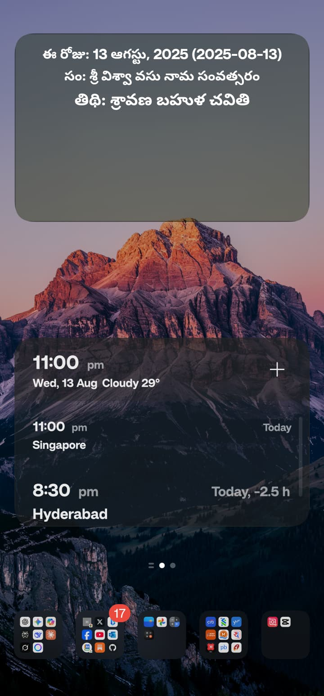
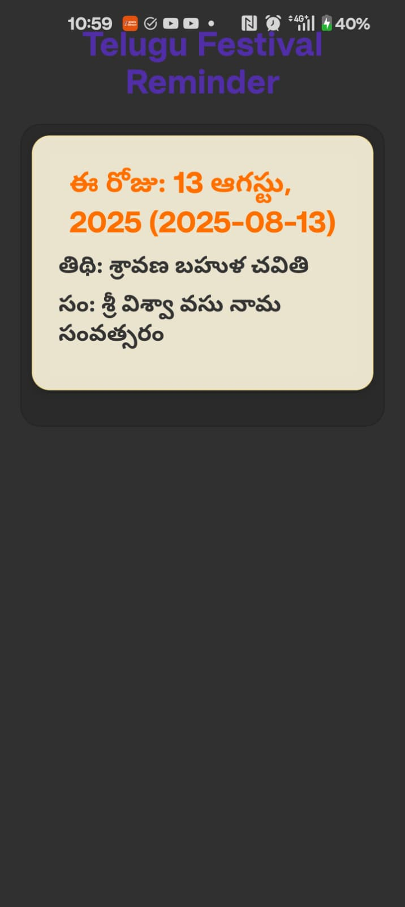

This is a new [**React Native**](https://reactnative.dev) project, bootstrapped using [`@react-native-community/cli`](https://github.com/react-native-community/cli).

# Getting Started

> **Note**: Make sure you have completed the [Set Up Your Environment](https://reactnative.dev/docs/set-up-your-environment) guide before proceeding.

## Step 1: Start Metro

First, you will need to run **Metro**, the JavaScript build tool for React Native.

To start the Metro dev server, run the following command from the root of your React Native project:

```sh
# Using npm
npm start

# OR using Yarn
yarn start
```

## Step 2: Build and run your app

With Metro running, open a new terminal window/pane from the root of your React Native project, and use one of the following commands to build and run your Android or iOS app:

### Android

```sh
# Using npm
npm run android

# OR using Yarn
yarn android
```

#### Android build with single-source JSON (widget sync)

This project keeps a single source of truth for festival data at `assets/festivals2025.json`.
On Android builds, the file is copied into `android/app/src/main/assets/` so the widget can read it.

Use the script to build and ensure the file is synced:

```sh
# Debug build
npm run android:build

# Release build
npm run android:build:release
```

## Planned enhancements

Note: these are design notes for future work — documented here so we can pick them up later.

1) Tokenized festival files (yeared / token-based merging)

- Goal: allow the app to load/merge festival JSON files for multiple years or variants without manual midnight pushes.
- Proposal: use a filename token so the loader can discover and merge matching files in `assets/`.
	- Example token: `festivals_TE`.
	- Files: `assets/festivals_TE2025.json`, `assets/festivals_TE2026.json`, etc.
	- Loader behaviour (planned): when token `festivals_TE` is configured, the app will load all files matching that prefix + year pattern, merge their arrays in year order, and use the combined list at runtime.
	- Fallback: if no token is configured, keep current behaviour and load `assets/festivals2025.json`.
	- Notes: build scripts (the `copyFestivalJson` Gradle task / scripts) will need a small update to either copy the merged file into `android/app/src/main/assets/` or copy all matching files; merging/deduplication rules can be added later.

2) Tokenize UI labels for localization

- Goal: make all visible labels (for example: the Telugu labels `తిథి`, `సం`, `పండుగలు`, `ఈ రోజు`, `రాబోయే పండుగలు`) configurable via a small i18n layer so the app can be extended to other languages easily.
- Proposal: replace hard-coded label strings with lookups (example keys):
	- `label.today` (e.g. `"ఈ రోజు:"`)
	- `label.thidi` (e.g. `"తిథి:"`)
	- `label.year` (e.g. `"సం:"`)
	- `label.festivals` (e.g. `"పండుగలు:"`)
	- `label.upcoming` (e.g. `"రాబోయే పండుగలు (2 రోజుల్లో):"`)
- Implementation note: add a small `locales/` folder (for example `locales/en-ZA.json`, `locales/te-IN.json`) and a tiny lookup helper; default to the current Telugu strings where keys are missing.

These two changes make the festival data and UI strings extensible without large structural changes. We can implement them incrementally:
- Step 1: implement the runtime loader that accepts a token and merges matching `assets/` files.
- Step 2: add a small i18n helper and replace hard-coded labels with keys.
- Step 3: update build scripts to copy the right assets for Android widget packaging.

We can pick these up after the current release is live.

Notes:
- The Gradle build also runs the copy step automatically via the `preBuild` hook.
- You can still use `npm run android` to install & run; for CI or manual builds prefer the script above.

### iOS

For iOS, remember to install CocoaPods dependencies (this only needs to be run on first clone or after updating native deps).

The first time you create a new project, run the Ruby bundler to install CocoaPods itself:

```sh
bundle install
```

Then, and every time you update your native dependencies, run:

```sh
bundle exec pod install
```

For more information, please visit [CocoaPods Getting Started guide](https://guides.cocoapods.org/using/getting-started.html).

```sh
# Using npm
npm run ios

# OR using Yarn
yarn ios
```

If everything is set up correctly, you should see your new app running in the Android Emulator, iOS Simulator, or your connected device.

This is one way to run your app — you can also build it directly from Android Studio or Xcode.

## Step 3: Modify your app

Now that you have successfully run the app, let's make changes!

Open `App.tsx` in your text editor of choice and make some changes. When you save, your app will automatically update and reflect these changes — this is powered by [Fast Refresh](https://reactnative.dev/docs/fast-refresh).

When you want to forcefully reload, for example to reset the state of your app, you can perform a full reload:

- **Android**: Press the <kbd>R</kbd> key twice or select **"Reload"** from the **Dev Menu**, accessed via <kbd>Ctrl</kbd> + <kbd>M</kbd> (Windows/Linux) or <kbd>Cmd ⌘</kbd> + <kbd>M</kbd> (macOS).
- **iOS**: Press <kbd>R</kbd> in iOS Simulator.

## Congratulations! :tada:

You've successfully run and modified your React Native App. :partying_face:

### Now what?

- If you want to add this new React Native code to an existing application, check out the [Integration guide](https://reactnative.dev/docs/integration-with-existing-apps).
- If you're curious to learn more about React Native, check out the [docs](https://reactnative.dev/docs/getting-started).

# Troubleshooting

If you're having issues getting the above steps to work, see the [Troubleshooting](https://reactnative.dev/docs/troubleshooting) page.

# Learn More

To learn more about React Native, take a look at the following resources:

- [React Native Website](https://reactnative.dev) - learn more about React Native.
- [Getting Started](https://reactnative.dev/docs/environment-setup) - an **overview** of React Native and how setup your environment.
- [Learn the Basics](https://reactnative.dev/docs/getting-started) - a **guided tour** of the React Native **basics**.
- [Blog](https://reactnative.dev/blog) - read the latest official React Native **Blog** posts.
- [`@facebook/react-native`](https://github.com/facebook/react-native) - the Open Source; GitHub **repository** for React Native.

## Widget screenshots

The following screenshots show how the home-screen widget appears on Android.




